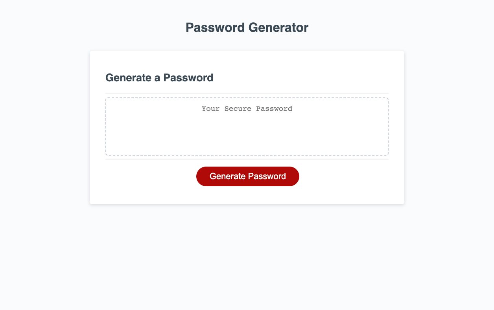

# Password Generator

## Description 

The following project demonstrates a working password generator with a series of prompts for password criteria. The user can pick from different character sets Lowercase, Uppercase, Numeric and Special characters. After confirming their choices the users newly generated password is first previewed in an alert box, if confirmed, then displays in the HTML's text area. If the user doesnt choose any of the character set options, then the user will be taken back to the beginning starting with the prompt "You must choose at least one character type".

## Author 

Keegan Omel

## Contributors

Austin Grech,
Bruno Rosarini,

## Live Link 

https://keegan-omel.github.io/Password-Generator/

## GitHub Link

https://github.com/Keegan-Omel/Password-Generator
